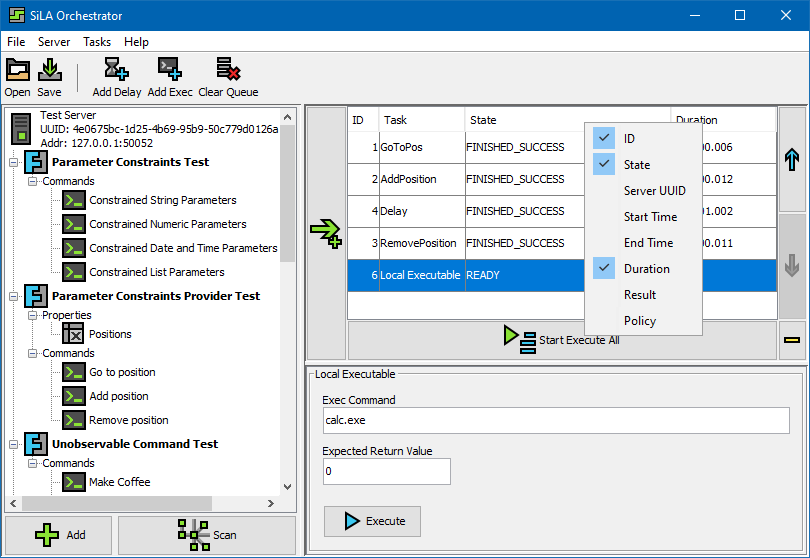

#  sila-orchestrator


A simple, dynamic [SiLA 2](https://sila-standard.com/) compliant client for coordinating various 
services. The main goal of this client is to easily link different SiLA 2 commands together, to 
create an automated, continuous workflow between distinct devices. For a short function overview and 
a description on how to use this software, take a look into the [User Guide](doc/UserGuide.md).




### Build the Project

First, clone the repository.
```bash
git clone --recurse-submodules https://github.com/FlorianBauer/sila-orchestrator.git
```

To build this project, a JavaSE/JDK in version >= 11 and <= 13, as well as a moderately current 
Maven installation is required. Enter the project directory and use the following command to start 
the build process:

```bash
cd path/to/sila-orchestrator/
mvn clean install -DskipTests
```

After that, the resulting `*.jar`-file is located in the `orchestrator-client/target`-directory as 
`orchestrator-client-exec.jar`.


### Usage

Starting the sila-orchestrator GUI client: `java -jar orchestrator-client-exec.jar`.

Using the client within the command line:
```
Usage: java -jar orchestrator-client-exec.jar [args]
 -h, --help
	 Print this help message.
 -v, --version
	 Print the version number.
 --about, --info
	 Print some general information about this software.
 -x <silo file>, --execute <silo file>
	 Loads and executes the provided silo file.
```


### Menu Item Installer for Linux

For Ubuntu/Debian based Linux distributions, a menu-item can be created. Simply execute the 
`add-menuitem.bash` script in the `etc` directory of the project. To uninstall the system entry, run
the corresponding `remove-menuitem.bash` script.
