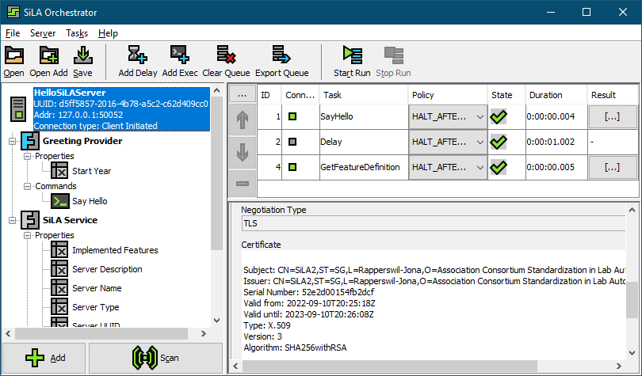

#  sila-orchestrator


A simple, dynamic [SiLA 2](https://sila-standard.com/) compliant client for coordinating various 
services. The main goal of this client is to easily link different SiLA 2 commands together, to 
create a automated, continuous workflow between distinct devices.




### Build the Project

To build this project, a moderately current JDK and Maven installation is required.
Enter the project directory and use the following command to to start the build process:

```bash
mvn clean install -DskipTests
```

After that, the resulting `*.jar`-file is located in the `orchestrator-client/target`-directory as 
`orchestrator-client-exec.jar`.


### Usage

Starting the silo-orchestrator GUI client: `java -jar orchestrator-client-exec.jar`.

Using the client within the command line:
```
Usage: java -jar orchestrator-client-exec.jar [args]
 -h, --help
	 Print this help message.
 -v, --version
	 Print the version number.
 --about, --info
	 Print some general information about this software.
 -x <silo file>, --execute <silo file>
	 Loads and executes the provided silo file.
```
