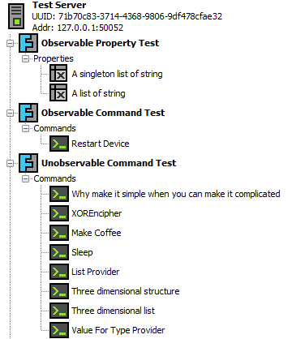
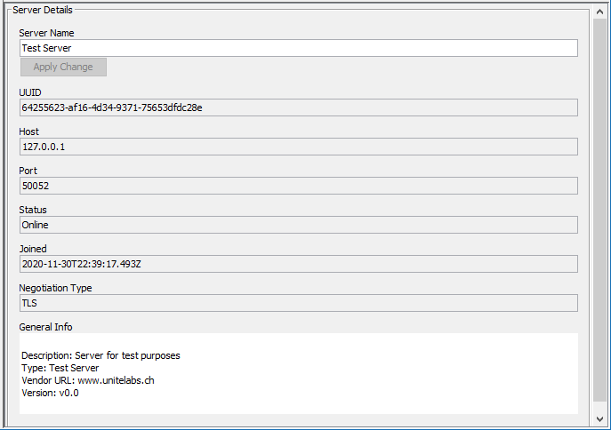
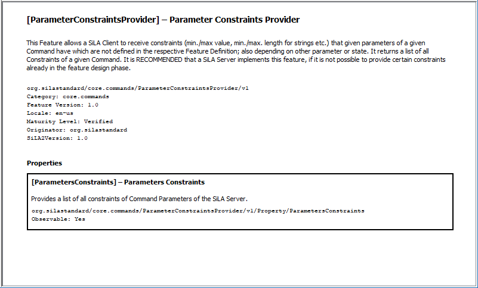
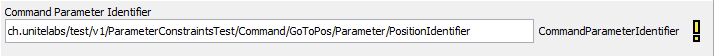
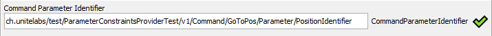
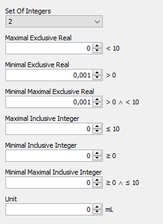
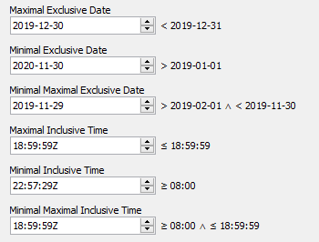
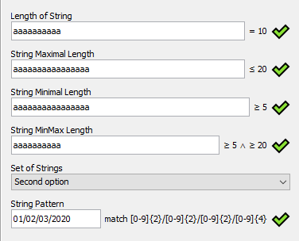

# User Guide

This guide provides a short descriptions of the available functionalities of the sila-orchestrator and how to use them. Instructions on how to build and run the software can be found in the [README](../README.md).

## Function Overview

* Discover SiLA servers with a network scan.
* Function for manually adding SiLA servers.
* Save and load task-queues with all their parameters to/from a file.
* Vilidators for constrained types (validate on `[Tap]`)
	- Ranges (numbers, date, time, timestamp, string lengths)
	- Regex match expressions
	- List ranges
	- Sets
	- XML
	
* Export function to save the current task queue data to a *.csv sheet.
* Enabled editing for constrained SiLA Properties to validate after pressing `[Tap]` (It's not a bug, it's a feature!).
* Support for binary types.
* Support for Images (jpeg, png, gif).
* Built-in function for time delays.
* Built-in function to locally execute programs and scripts on the client host.
* Show Results in Raw- or Node-View.
* Headless mode for CLI.
* Platform independent. Runs on Windows, Linux and any other OS with a JavaSE/JDK 11 installation.

## Basic Functions

Click the *Scan*  button or press `[Alt]+[C]` to search in the local network for discoverable SiLA servers.

If a server can not be discovered (e.g. does not support the discover-function or is hidden in the network on purpose), a manual connection can be established by clicking the *Add*  button or `[Alt]+[A]` to open the configuration window.

To save the current task queue to a *.silo-file, click  or use the shortcut `[Ctrl]+[S]`.

To open a existing *.silo-file, click  or press `[Ctrl]+[O]`.

To add a delay-task to the end of the queue, click *Add Delay*  or drag the icon from the toolbar directly into the desired position in the task queue.
When a delay-task was added to the queue and gets executed, the set timer gets triggered, and the execution of the next element in the queue gets delayed until the timer runs out.

To add a local execution tasks, use the *Add Exec*  button to insert, or drag the icon from the toolbar into the task queue.
If the inserted task in the queue gets then selected, a command and its arguments, as well as its expected return value, can be set.
The return value of a successful run depends on the corresponding command, but is usually 0.
Also, the concrete syntax of the command depends on the operating system of the client.

**Some examples on Linux:**  
Run a bash-command:
`/bin/bash -c "sleep 5"`, expected return value `0`.  
Run a bash-command inside a terminal* (depending on the Linux distro, the terminal application can also be `mate-terminal`, `xfce4-terminal`, `xterm`, etc.):
``gnome-terminal -- bash -c "echo This bash-command runs on `hostname`.; sleep 5"``, expected return value `255`.

**Some examples on Windows:**  
Open the calculator:
`calc`, expected return value `0`  
Execute a command in the Windows PowerShell:
`powershell "sleep 5"`, expected return value `0`.

*Clear Queue*  purges all entries form the current queue.

The current data in the queue can be exported any time to a *.csv-file with *Export Queue* . The *.csv-file can then be imported and used with a common spreadsheet program (e.g. LibreOffice Calc or Microsoft Excel). Note that the exported data is only meant to be used for archiving or analysis purposes. A import back to the sila-orchestrator is therefore not possible.

## Server and Feature Entries

After successfully establishing a connection to at least one SiLA complaint server, the left panel shows various, hierarchically grouped  entries. By hovering over one of these entries, the corresponding SiLA description will appear.

 Symbol                                                           | Description 
------------------------------------------------------------------|-------------
     | A server node which is available and online.
    | A server node which has become offline.
      | A regular SiLA Feature.
 | A SiLA Core Feature.
          | A Feature property.
           | A Feature command.

## Task Queue

The task queue is one of the main components of the sila-orchestrator. All the SiLA commands and tasks within the queue can be chained together and executed one after another. This enables the User to build complex, automated workflows, run them, store them and re-run them over again without repeating all the configuration steps.

Now, before the queue can be executed, it must be filled with tasks first. To do this, select a command and click the  button to append it to the end of the queue, or drag  directly into the desired location within the queue.

The order of a task can be changed by moving its position with the  and  buttons.

To remove a task, use the  button.

Finally, to run the entire task queue, click the   button.

To abort the current run, click .

### Queue Columns

The task queue itself consists of the following columns:

* ID
* Connection
* Task
* Server UUID
* Policy
* State
* Start Time
* End Time
* Duration
* Result

Not all columns are on display by default but can selectively be shown or hidden by clicking the `...`-button at the upper-right corner or by right-clicking in the column header of the table.

The *ID* field holds a unique number to identify the task. The number can be edited by double-clicking into the cell.

The *Connection* column shows with an online , or an offline  symbol if the task is ready for execution. A neutral  symbol (e.g. on delay-tasks) indicates that no network connection is necessary.

*Task* holds the command identifier.

The *Server UUID* column holds the Universal Unique IDs of the server instances for each task. The instance of each task can be re-assigned by choosing a entry from the drop-down menu in the cell. This is especially useful when a *.silo-file from an older session is loaded but the UUID of the original server changed in the meantime. Therefore the UUID can be changed to the new instance to let the tasks become online and ready for execution once again.

The *Policy* column holds the entries for the error handling of each task. The contents can either be `HALT_AFTER_ERROR` or `PROCEED_AFTER_ERROR`. On `HALT_AFTER_ERROR`, the entire queue execution is stopped after the affected task finished with an error. If the value in the cell is set to `PROCEED_AFTER_ERROR`, a queue run is continued even if execution of the task was not successful.

The *State* column signals the current state of each task.
-  Neutral: The task is or was not executed (yet).
-  Running: The task is currently executed.
-  Finished with success: The task was run successfully.
-  Finished with error: The task failed or could not be completed.

The columns *Start Time* as well as *End Time* contain timestamp entries of the beginning and end of the task execution.

*Duration* shows the relative time a task took to finish.

The *Result* cells hold the outcome of each task execution. This can be an empty result `-`, an error message, or a SiLA element nested in the cell indicated by `[...]`. Note: Empty braces `{}` are also considered valid result values.

All columns in the table can be rearranged by dragging the corresponding column header into the desired position.

## Context Sensitive Views

According to the type of the current selected item, the panel in the bottom shows one of the following views.

### Server Detail View

The details of a server can be viewed when the corresponding  entry gets selected.

The server view shows various info and offers a built-in function for renaming the server:  

### Feature View

* Shows the information given in the Feature Definition in a clear, human-readable form.
* Shows `Fully Qualified Identifier` for every SiLA element.

### Property View

* Selecting a Property node shows the current SiLA Property values.
* Requesting a value update can be done by clicking  or by deselecting and selecting the node again.
* Not modifiable SiLA properties with a constraint get validated. The value can be edited to check against the validator by pressing `[Tab]`, but does not affect the actual value on the server.

Example:  
A not so SiLA complaint Command Parameter Identifier (just a example, no intention to blame the vendor of this server):  

The, according to the standard, correct Command Parameter Identifier the validator would accept:  

### Command View

To show and edit the parameter of a SiLA command, the command must be added to the task queue first. After that, the command can be selected in the task queue and the parameters can be set accordingly.

To execute a single command, without invoking any other entries in the task queue, click the  button.

Depending on the defined types of the various parameters, a SiLA constraint can limit available input options.

Examples of numeric constraints:  

Examples of date and time constraints:  

Examples of string constraints:  

